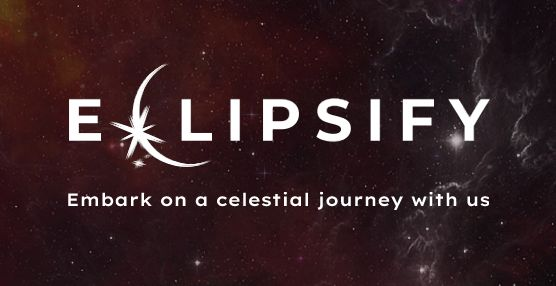
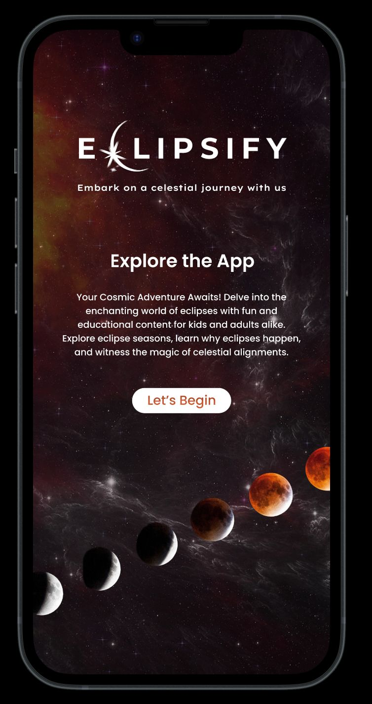
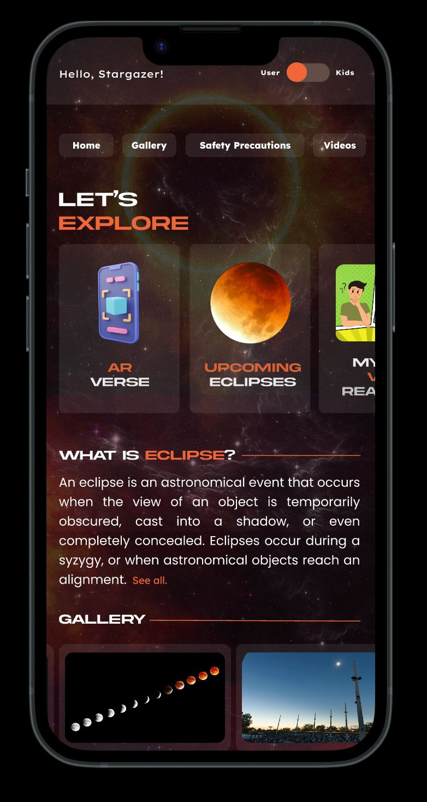
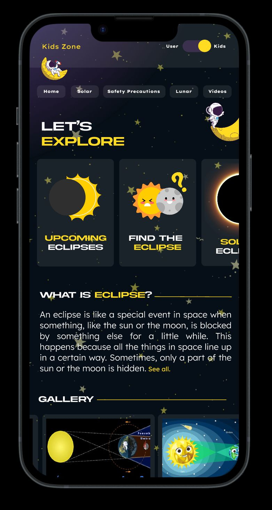

  
  <h1>👋 Welcome to Eclipsify!</h1>
  <h3>Embark on a celestial journey with us</h3>

This is the repo for the Eclipsify App, an experience built around space exploration starting with Eclipses.

## Figma Link (UI)
Find the detailed UI [here!](https://www.figma.com/file/mTu99F6os5cN1Pnx7FzEaB/Hackout?type=design&node-id=0%3A1&mode=design&t=QM1erxePM5kbw5mw-1)

  
  
  

